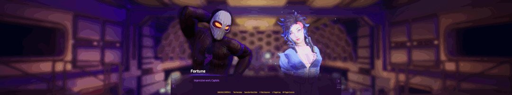

## Subverse ultrawide and wider

The tool removes the side black bars displayed in the game at 21:9 and wider aspect ratios.

The in-game FMVs are pre-rendered and can be found in its folder, so they will not be affected.

1. [Download](/../../releases) and unpack the archive.
2. Launch the game first, followed by the tool.
3. Press the hotkey as instructed.

All trainers based on CE components may trigger some anti-virus software.

Tested on the latest GOG.com version at 2560x1080, 3840x1080, and 5760x1080.

### Credits
The field of view calculation formula implementation was based on killer-m's work.
